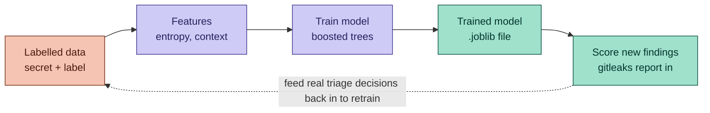
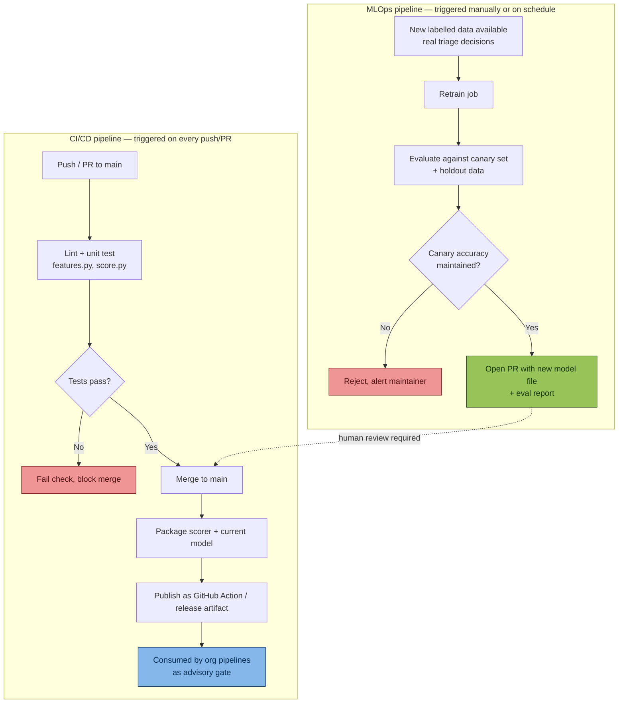

# leak-triage-ml

A lightweight ML classifier that sits on top of Gitleaks and re-ranks its
findings by likelihood of being a real secret, using context Gitleaks itself
doesn't see.


## Status

Early design phase. No code yet. This README is the living design doc — it
gets updated as decisions are made, not written once and left stale.

## Problem statement

Gitleaks flags any string matching a secret pattern or exceeding an entropy
threshold, regardless of context. This produces a high volume of false
positives — test fixtures, hashes, UUIDs, placeholder values — which causes
alert fatigue and risks real secrets being ignored among the noise.

## Goal

Build a lightweight classifier that re-scores Gitleaks findings using
contextual signals (file path, variable name, string structure) that Gitleaks
itself doesn't use, to separate likely real secrets from likely false
positives — reducing manual triage effort without weakening detection.

## Non-goals

- Replacing Gitleaks' detection logic (regex + entropy stays as the first pass).
- Fully auto-suppressing findings without human review, at least initially.
- Detecting secrets Gitleaks itself would miss — this is a triage layer, not
  a scanner.

## Architecture (planned)

```
Gitleaks scan (JSON output)
        │
        ▼
Feature extraction  ──  entropy, char composition, file-path context,
        │                variable-name context, rule-ID precision
        ▼
Trained classifier  ──  gradient-boosted trees
        │
        ▼
Scored findings  ──  ml_probability + ml_verdict per finding
        │
        ▼
Human review (early on) / CI gate (once validated)
        │
        └──> real triage decisions feed back in as future training data
```

## Pipeline



## Design decisions made so far

- **Approach: classifier bolt-on**, not a custom scanner or anomaly detector.
  Considered alternatives: replacing Gitleaks' entropy check entirely,
  unsupervised anomaly detection (no labels needed, but weaker precision and
  harder to explain), an active-learning review queue, and per-rule mini
  models. Bolt-on is the simplest option that doesn't require maintaining a
  scanner, and lets us start with supervised learning fundamentals before
  layering complexity.
- **Labels stay human-owned.** The retraining loop pulls from real triage
  decisions, not automated heuristics, because that's the only reliable
  ground truth available.

## Known risk: label-flipping / training-data poisoning

Because the retraining loop uses human triage decisions as ground truth,
anyone who can influence those decisions (compromised account, insider,
sloppy triage habits) can poison the training set without touching model
code — shifting the decision boundary so a targeted secret shape gets
misclassified as benign. This is distinct from evasion attacks against an
already-trained model.

Mitigations to build in from the start, not bolt on later:
- Treat the labelled retraining dataset like code — PR review required, no
  direct writes.
- Maintain a small held-out canary set of known real secret shapes; block any
  retrain that drops canary accuracy.
- Keep `likely_false_positive` as a deprioritisation signal, not an
  auto-suppression, until precision is validated against real outcomes.
- Flag near-duplicate feature vectors with conflicting labels for a second
  reviewer before they enter training data.

## Roadmap

- [ ] Define feature set (entropy, char composition, context signals)
- [ ] Build feature extraction module
- [ ] Assemble initial labelled dataset (synthetic first, real triage history later)
- [ ] Train baseline gradient-boosting model
- [ ] Evaluate (precision/recall, not just accuracy — false negatives are
      costly here)
- [ ] Build scorer that consumes real Gitleaks JSON output
- [ ] Add canary-set check to the training pipeline
- [ ] Wire into CI as an advisory layer (no auto-suppression yet)
- [ ] Establish process for feeding real triage decisions back into training data

## Tech stack (planned)

- Python
- scikit-learn (gradient boosting)
- pandas
- Gitleaks (external dependency — this project consumes its JSON output)

## Contributing / retraining

Not yet applicable — single-developer learning project at this stage. Once a
retraining process exists, this section will document how to submit labelled
examples and how the canary set is validated before any model update ships.